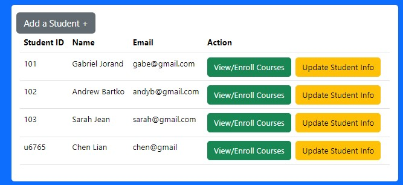
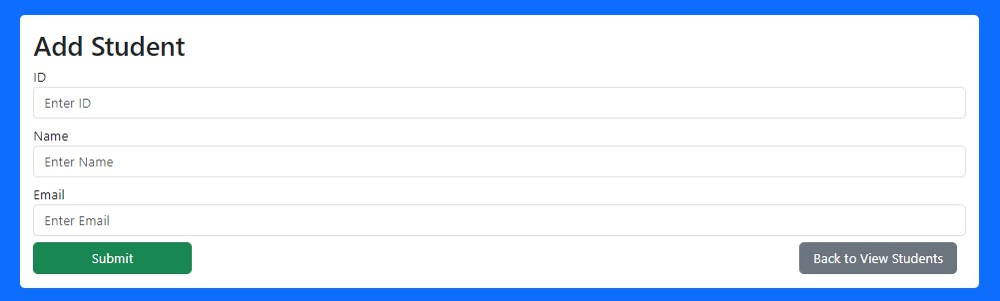
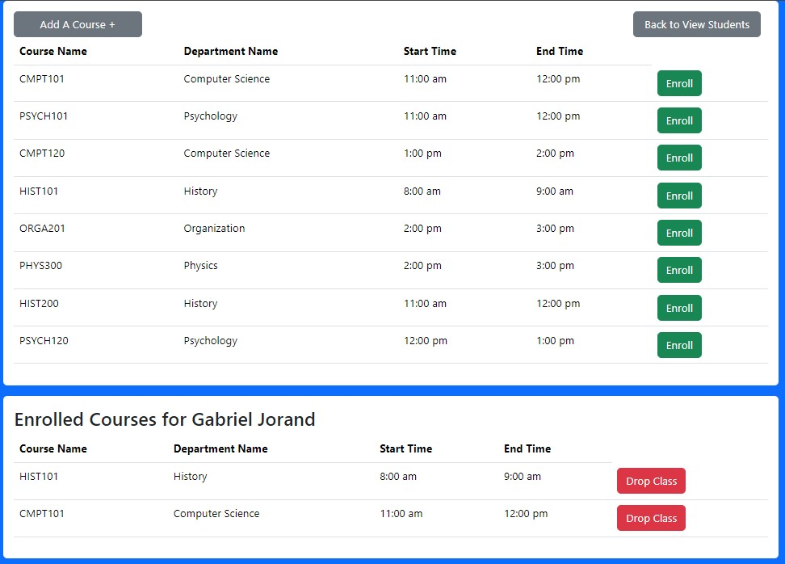
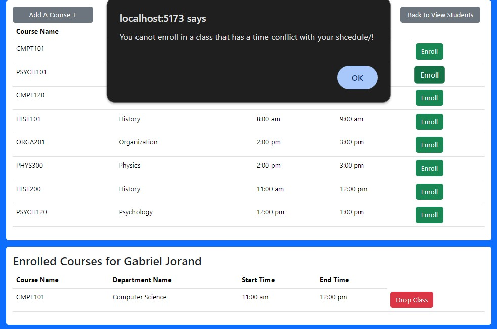

🎓 University Student Registration System (MERN Stack) 

  

Overview

This project is a full-stack student registration platform developed using the MERN stack (MongoDB, Express.js, React, Node.js). It simulates a basic university enrollment system, enabling users to manage student profiles, add new courses, and register students into available classes.

The system includes functionality for:

-Creating and managing student records

-Creating and managing course offerings

-Student course enrollment with schedule conflict and prerequisite validation

-Dropping courses

CRUD operations for both students and courses through a clean, responsive web UI

Designed as an academic project to demonstrate real-world application of RESTful API architecture, database integration, frontend routing, and form validation with attention to modularity and scalability.

✨ Key Features
- Student Management
Add, update, and view detailed student records.

- Course Management
Create and manage course offerings dynamically.

- Registration & Enrollment
Enroll students into classes with automatic checks for schedule conflicts and prerequisite requirements.

- Conflict Detection
Prevents students from enrolling in overlapping classes based on timeslot analysis.

- Prerequisite Enforcement
Automatically verifies course prerequisites during enrollment.

- Modern Frontend
Built with React and Bootstrap for a clean, mobile-friendly UI.

- Secure Backend
Node.js and Express.js server architecture, using MongoDB for flexible and scalable data storage.

🖥️ Screenshots

  
 
  
 
  

⚙️ Tech Stack
Frontend: React.js, React Router, Bootstrap 5, Axios

Backend: Node.js, Express.js

Database: MongoDB Atlas

Development Tools: Visual Studio Code, Postman (API Testing), Git

📚 Project Architecture
- Component-based Frontend
Organized React components for students, courses, creation forms, and updates.

- RESTful API
Express.js backend with clearly separated route handling and controller logic.

- Database Structure
MongoDB collections for Students and Courses, relational management through IDs.

- Server-Side Validation
Enrollment operations include server-side validation for time conflicts and prerequisite completion.

- Error Handling
Consistent error responses across backend services for stability.

🏗️ Core Concepts Demonstrated
Full CRUD operations across multiple entities

- Frontend and backend separation of concerns

- Data validation and error handling on both frontend and backend

- Schedule conflict detection using timeslot comparison logic

- Prerequisite validation through linked database queries

- Modular and scalable project organization

- Responsive, accessible UI design
